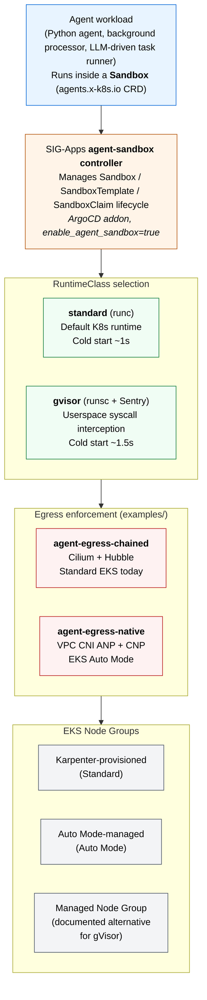

# Agent Sandbox on EKS — Solution Blueprint

## Table of Contents

- [Overview](#overview)
- [Architecture](#architecture)
- [Components](#components)
- [Plan Your Deployment](#plan-your-deployment)
  - [AWS Services](#aws-services)
  - [Cost](#cost)
- [Security](#security)
- [Prerequisites](#prerequisites)
- [Quick Start Guide](#quick-start-guide)
  - [Deploy the Infrastructure](#deploy-the-infrastructure)
  - [Apply the Workload Manifests](#apply-the-workload-manifests)
  - [Add Egress Enforcement](#add-egress-enforcement)
  - [Validate the Deployment](#validate-the-deployment)
- [Configuration Options](#configuration-options)
- [Troubleshooting](#troubleshooting)
- [Cleanup](#cleanup)

## Overview

This solution deploys a secure, FQDN-filtered Kubernetes environment for running isolated AI agent workloads on Amazon EKS. It combines the [kubernetes-sigs/agent-sandbox](https://github.com/kubernetes-sigs/agent-sandbox) controller (CRD-driven sandbox lifecycle management) with runtime-level isolation tiers (`standard` = runc, `gvisor` = userspace syscall interception via [runsc](https://gvisor.dev/)) and composable egress enforcement (chained Cilium FQDN filtering today, EKS-native `ApplicationNetworkPolicy` on Auto Mode).

Agents that execute model-generated code need two guarantees the default Kubernetes pod doesn't provide:

- **Kernel boundary isolation**: untrusted code running inside the sandbox must not have access to the host kernel's full syscall surface. gVisor's Sentry intercepts syscalls in userspace and serves a restricted subset; Kata+Firecracker (documented as a future tier) adds hardware-virtualization boundaries.
- **Egress policy enforcement**: agents call LLM APIs, package registries, and developer tools. Without an allowlist, a compromised agent can exfiltrate data or probe internal services. FQDN filtering limits egress to a pre-approved set of destinations.

This solution delivers both. The reference agent (under [`../../../blueprints/agents/agent-sandbox/`](../../../blueprints/agents/agent-sandbox/)) exercises the full chain: provisions inside a gVisor-isolated Sandbox, fetches credentials via IRSA, calls Amazon Bedrock for content, executes model-generated code inside the Sentry boundary, and demonstrates both enforcement layers (FQDN block at DNS proxy + L3/L4 block at eBPF).

## Architecture



Two composition paths ship with this solution:

- **Direct Sandbox** (`manifests/sandbox-agent.yaml`) — three Kubernetes resources applied explicitly: `ServiceAccount`, `ConfigMap` (agent script), `Sandbox`. Useful when building your own agent manifests and seeing the full spec.
- **KRO AgentSandbox** (`manifests/agent-sandbox-instance.yaml` + `manifests/rgd-agent-sandbox.yaml`) — the same three resources composed from a single `AgentSandbox` custom resource via kro. The `ResourceGraphDefinition` takes an `iamRoleArn`, `runtimeClass`, `scriptConfigMap` reference, and Bedrock region/model, and materializes the full pod with the same hardened execution context (readOnlyRootFilesystem, runAsNonRoot, writable workspace + tmp volumes, HOME override for `pip install --user`). Useful when exposing a simpler surface to your team.

Both paths produce an equivalent running pod on a gVisor node with IRSA credentials plumbed.

## Components

| Component | Version | Purpose |
|-----------|---------|---------|
| [kubernetes-sigs/agent-sandbox](https://github.com/kubernetes-sigs/agent-sandbox) | v0.4.5 | Sandbox / SandboxTemplate / SandboxClaim controller |
| [kro](https://kro.run/) | 0.9.1 | ResourceGraphDefinition-based composition |
| [gVisor](https://gvisor.dev/) | runsc (AL2023) | Userspace syscall interception for gvisor tier |
| [Karpenter](https://karpenter.sh/) | Bundled with base module | Node autoscaling with a dedicated gVisor NodePool |
| [Cilium](https://cilium.io/) + [Hubble](https://github.com/cilium/hubble) | 1.19.x | FQDN egress enforcement + flow observability (chained example) |
| VPC CNI (`ApplicationNetworkPolicy`) | v1.21.1+ | Native FQDN egress enforcement on Auto Mode (native example) |

### Runtime tiers

Each tier is a weaker boundary than the one below it — tier choice maps to a threat model, not a "is it secure enough?" question.

| Tier | Boundary | Protects against | Does NOT protect against |
|------|----------|------------------|--------------------------|
| `standard` (runc) | Linux namespaces + seccomp | Other pods in the cluster (network policies + RBAC) | Host kernel exploitation, syscall abuse, cgroup escapes |
| `gvisor` (runsc + Sentry) | Userspace syscall interception | Host kernel exploitation for ~99% of common syscalls (Sentry serves restricted subset). Malicious binaries cannot directly invoke host kernel. | Cold-start overhead (~60-90s for first pod per node); some specialized syscalls fall back to host (ptrace, certain perf paths); Sentry itself is a trusted computing base |
| Kata + Firecracker (future) | Hardware-enforced microVM (KVM) | All of the above, including hardware-level side channels. Each sandbox gets its own VM with isolated CPU state. | Not shipped in this solution — requires nested virtualization support which EKS Managed Node Groups do not yet provide. See [tracking issue](https://github.com/awslabs/ai-on-eks/issues) for status. |

### Tier selection

1. Does your agent execute untrusted code (prompts that generate + run code, user-uploaded scripts, model-generated shell)?
   - **Yes** → `gvisor` or Kata+Firecracker (once available). Syscall isolation is the differentiator.
   - **No** → `standard` may be sufficient; network policy + RBAC still apply.

2. Does your threat model include malicious first-party code (a compromised agent image, an insider-threat scenario)?
   - **Yes** → Kata+Firecracker (hardware boundary) when available.
   - **No** → `gvisor` is still a reasonable default for code-executing agents even in single-tenant deployments.

## Plan Your Deployment

### AWS Services

| AWS Service | Role | Description |
|-------------|------|-------------|
| [Amazon EKS](https://aws.amazon.com/eks/) | Core | Managed Kubernetes control plane |
| [Amazon EC2](https://aws.amazon.com/ec2/) | Core | Compute instances for Karpenter NodePools (incl. gVisor-capable nodes) |
| [Amazon VPC](https://aws.amazon.com/vpc/) | Core | Private networking with NAT for egress |
| [Amazon Bedrock](https://aws.amazon.com/bedrock/) | Optional | LLM inference for the reference agent (other providers reachable via egress allowlist) |
| [AWS IAM](https://aws.amazon.com/iam/) | Security | IRSA-based credential injection (`eks.amazonaws.com/role-arn`) |
| [AWS KMS](https://aws.amazon.com/kms/) | Security | Encryption key management for EBS + secrets |

### Cost

The solution itself does not introduce recurring cost beyond the base cluster infrastructure. Expect the following under default settings (prices subject to change; use [AWS Pricing Calculator](https://calculator.aws) for your workload):

- Base EKS cluster: ~$73/month (control plane)
- NAT Gateway: ~$33/month per AZ
- Karpenter-provisioned EC2 instances: varies by workload (default NodePools idle to zero)
- gVisor nodes: same EC2 pricing as standard nodes (gVisor adds CPU + memory overhead, not a cost tier)

Bedrock inference is billed per-token by the model provider and is independent of the cluster cost.

## Security

### Identity and Access Management

- **IRSA** (IAM Roles for Service Accounts) provides AWS credentials to sandboxed pods without static keys. Trust policies scope to `system:serviceaccount:<namespace>:<sa>`. Templates for Bedrock access at `manifests/iam-bedrock-trust-policy.template.json` and `manifests/iam-bedrock-permissions.template.json`.
- **Pod Identity is intentionally NOT used for gVisor-tier sandboxes**: the credential endpoint at 169.254.170.23 is not reachable from within Sentry's network namespace. Standard-tier workloads can use Pod Identity; gVisor workloads use IRSA. See [threat model](#runtime-tiers) for the rationale.

### Network Security

- **Default-deny egress**: the solution does NOT apply network policies on its own. Egress behavior depends on which example you pair it with (`agent-egress-chained` for Cilium FQDN filtering, `agent-egress-native` for VPC CNI `ApplicationNetworkPolicy`). Without one of these, the sandbox has unrestricted egress.
- **IMDS denial at admin tier**: both egress examples block 169.254.169.254 (EC2 Instance Metadata v1/v2) and 169.254.170.2 (ECS task metadata) via admin-scoped policies for the `agent-sandboxes` namespace. This prevents agents from escalating to node-level credentials.
- **Two enforcement layers, two observability surfaces**: FQDN filtering happens at the DNS proxy (blocks resolve to empty answer, no TCP attempt follows). L3/L4 filtering happens at the data plane (SYN packet drop). The reference agent's Step 4 exercises the DNS layer; Step 5 exercises L3/L4.

### Kubernetes Security

- **runAsNonRoot**, **readOnlyRootFilesystem**, **capabilities drop ALL**, **allowPrivilegeEscalation: false** in the default sandbox pod spec.
- **RuntimeClass selection** (`gvisor` vs default) is the primary isolation signal.
- **Karpenter NodePool taints** (`agent-sandbox/runtime=gvisor:NoSchedule`) ensure only tolerating pods land on gVisor-capable nodes, preventing incidental scheduling of non-sandboxed workloads.

## Prerequisites

- AWS credentials with permissions for VPC, EKS, IAM, EC2.
- For the reference agent: an IAM role with `bedrock:InvokeModel` on the target Claude model and an IRSA trust policy allowing the cluster's OIDC provider for `system:serviceaccount:agent-sandboxes:sandbox-agent-sa`.
- `terraform >=1.0`, `kubectl >=1.30`, `helm >=3.0`, `aws` CLI v2.

### Verify Setup

```bash
aws sts get-caller-identity
kubectl version --client
terraform version
helm version
```

## Quick Start Guide

### Deploy the Infrastructure

```bash
git clone https://github.com/awslabs/ai-on-eks.git
cd ai-on-eks/infra/solutions/agent-sandbox

# (Optional) Edit terraform/blueprint.tfvars to change region or toggle Auto Mode
./install.sh                                             # 20-30 min
```

The solution's `blueprint.tfvars` enables the `agent-sandbox` controller and `kro` as ArgoCD-managed addons via the base module. After `install.sh` completes, the cluster is up with:

- Karpenter ready for Node provisioning
- `agent-sandbox-system` namespace with the controller running
- `kro-system` namespace with kro running
- ArgoCD syncing both continuously

```bash
aws eks update-kubeconfig --name agent-sandbox --region <region>
kubectl get pods -n agent-sandbox-system
kubectl get pods -n kro-system
```

### Apply the Workload Manifests

The solution-specific Kubernetes resources (namespace, RuntimeClass, gVisor-capable Karpenter NodePool, SandboxTemplates, reference agent manifests, KRO ResourceGraphDefinition) live under `manifests/` and are applied by the user after the cluster is running. The NodePool and its EC2NodeClass reference the live cluster name and node IAM role, so substitute those in before applying:

```bash
cd manifests/

# Resolve the cluster name and Karpenter node role from the live cluster
export CLUSTER_NAME=$(aws eks describe-cluster --name agent-sandbox --query cluster.name --output text)
export KARPENTER_NODE_ROLE=$(kubectl get ec2nodeclass m6i-cpu -o jsonpath='{.spec.role}')

# Apply namespace + RuntimeClass + SandboxTemplates
kubectl apply -f namespace.yaml
kubectl apply -f runtimeclass-gvisor.yaml
kubectl apply -f sandbox-template-standard.yaml
kubectl apply -f sandbox-template-gvisor.yaml

# Apply the Karpenter NodePool (substitute placeholders, then apply)
sed -e "s|__CLUSTER_NAME__|$CLUSTER_NAME|g" \
    -e "s|__KARPENTER_NODE_ROLE__|$KARPENTER_NODE_ROLE|g" \
    karpenter-nodepool-gvisor.yaml \
    > /tmp/karpenter-nodepool-gvisor.rendered.yaml
kubectl apply -f /tmp/karpenter-nodepool-gvisor.rendered.yaml

# Apply the KRO ResourceGraphDefinition (optional — only needed for the AgentSandbox composition path)
kubectl apply -f rgd-agent-sandbox.yaml
```

### Add Egress Enforcement

Pick one of the two examples based on your cluster's compute mode:

- **Standard EKS** → [`examples/agent-egress-chained/`](examples/agent-egress-chained/) (Cilium + Hubble chaining)
- **EKS Auto Mode** → [`examples/agent-egress-native/`](examples/agent-egress-native/) (VPC CNI `ApplicationNetworkPolicy`)

```bash
cd examples/agent-egress-chained
./install.sh                                             # Standard EKS
# or
cd examples/agent-egress-native
./install.sh                                             # Auto Mode
```

Each example installs its own README with allowlist-template usage and portability notes between the two enforcement backends.

### Validate the Deployment

A reference agent lives under [`../../../blueprints/agents/agent-sandbox/`](../../../blueprints/agents/agent-sandbox/). It exercises the full chain — pip install, Bedrock call, snippet execution, FQDN block, IP block — and prints PASS/BLOCKED markers for each step.

```bash
cd ../../../blueprints/agents/agent-sandbox
CLUSTER_NAME=agent-sandbox \
BEDROCK_ROLE_ARN=arn:aws:iam::<account>:role/<role-with-bedrock-invokemodel> \
    ./conformance.sh
```

Conformance exits 0 on success and asserts all 5 expected PASS/BLOCKED outcomes.

## Configuration Options

| Variable | Description | Default |
|----------|-------------|---------|
| `name` | Cluster naming prefix | `agent-sandbox` |
| `region` | AWS region | Base module default (`us-west-2`); uncomment to override |
| `eks_cluster_version` | EKS version | `1.34` |
| `enable_agent_sandbox` | Deploy the SIG-Apps agent-sandbox controller via ArgoCD | `true` |
| `agent_sandbox_version` | kubernetes-sigs/agent-sandbox ref | `v0.4.5` |
| `enable_kro` | Deploy kro via ArgoCD | `true` |
| `kro_version` | kro Helm chart version | `0.9.1` |
| `enable_eks_auto_mode` | Use EKS Auto Mode instead of Karpenter-managed compute | `false` |

See [`../../base/terraform/variables.tf`](../../base/terraform/variables.tf) for the full set of toggleable base-module variables.

## Troubleshooting

### `pod/sandbox-agent` stuck in Pending

Most commonly: the gVisor Karpenter NodePool hasn't applied, or the runsc shim user-data is still installing on a fresh node. Check:

```bash
kubectl describe pod sandbox-agent -n agent-sandboxes
kubectl get nodeclaims -o wide
kubectl describe nodeclaim <gvisor-nodeclaim-name>
```

First pod on a fresh gVisor node takes 60-90s (Karpenter bootstrap + runsc shim install via AL2023 user-data). Subsequent pods on the same node are ~1.5s.

### `AccessDenied: AssumeRoleWithWebIdentity`

The IAM role's trust policy subject doesn't match the ServiceAccount path. Verify:

```bash
aws iam get-role --role-name <role-name> --query 'Role.AssumeRolePolicyDocument' --output json
```

The `StringEquals`/`StringLike` condition must include `system:serviceaccount:agent-sandboxes:sandbox-agent-sa` (and `:composed-sandbox` if you're using the KRO path). Update via `aws iam update-assume-role-policy`.

### Agent runs but output is empty

The container's `cp /config/agent.py /workspace/agent.py` happens once at pod start. If the ConfigMap was updated after the pod was Ready, the workspace still has the old content. Recreate the pod:

```bash
kubectl delete pod sandbox-agent -n agent-sandboxes
kubectl -n agent-sandboxes wait --for=condition=Ready pod/sandbox-agent --timeout=120s
```

### Hubble UI shows no flows for `agent-sandboxes` namespace

Hubble UI's default Service Map filters blacklist DNS events and pods without sustained TCP traffic. The FQDN-block step (Step 4 of the reference agent) produces only DNS events (Cilium's DNS proxy returns empty answer), so nothing appears in the Service Map. This is expected — the L3/L4 block in Step 5 (raw TCP to 8.8.8.8) produces a visible DROPPED flow. Use `cilium observe --namespace agent-sandboxes` to see the DNS proxy verdicts.

## Cleanup

```bash
cd infra/solutions/agent-sandbox
./cleanup.sh
```

The wrapper drops Karpenter finalizers (so EC2NodeClass + NodePool deletes don't stall when the controller is gone), then runs the base module's `cleanup.sh`, then sweeps any auxiliary AWS resources by tag (orphan placement groups, ENIs, KMS aliases, CloudWatch log groups). IAM roles created outside the solution (e.g., the Bedrock role) are not deleted.
