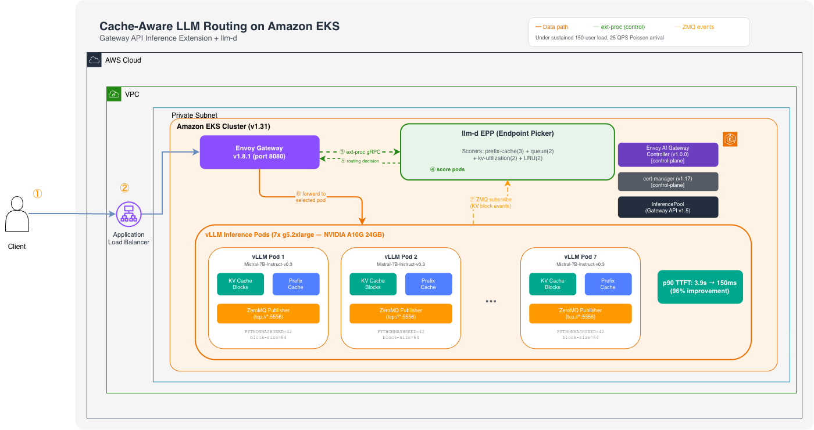

# llm-d Cache-Aware Routing on Amazon EKS

## Table of Contents

- [Overview](#overview)
- [Architecture](#architecture)
- [Plan Your Deployment](#plan-your-deployment)
  - [AWS Services](#aws-services-in-this-solution)
  - [Cost](#cost)
  - [Security](#security)
- [Quick Start Guide](#quick-start-guide)
  - [Prerequisites](#prerequisites)
  - [Deploy the Solution](#deploy-the-solution)
  - [Validate the Deployment](#validate-the-deployment)
  - [Run the Benchmark](#run-the-benchmark)
- [Benchmark Results](#benchmark-results)
- [How It Works](#how-it-works)
  - [Request Flow](#request-flow)
  - [Precise Scoring Pipeline](#precise-scoring-pipeline)
- [Monitoring](#monitoring)
- [Troubleshooting](#troubleshooting)
- [Cleanup](#cleanup)
- [References](#references)
- [License](#license)

## Overview

When serving LLMs at scale with multiple vLLM replicas, standard Kubernetes load balancing (round-robin) scatters a user's successive requests across different pods. Each new pod must recompute the full conversation context from scratch, wasting GPU cycles and inflating time-to-first-token (TTFT).

This solution deploys **precise KV-cache-aware routing** using [llm-d](https://llm-d.ai/) (CNCF Sandbox) on Amazon EKS. It maintains a real-time global index of KV-cache blocks across the vLLM fleet and routes each request to the pod with the highest prefix-cache affinity.

**Result**: Up to **96% reduction in p90 TTFT** under sustained 150-user multi-turn load compared to round-robin, with no model or application code changes.

### Components

| Component | Role | Version |
|-----------|------|---------|
| [vLLM](https://docs.vllm.ai/) | LLM inference engine with prefix caching + KVEvents | v0.22+ |
| [llm-d](https://llm-d.ai/) | Cache-aware request scheduler (CNCF Sandbox) | v0.5+ |
| [Envoy Gateway](https://gateway.envoyproxy.io/) | L7 proxy with ext-proc filter | v1.8.1 |
| [Envoy AI Gateway](https://aigateway.envoyproxy.io/) | InferencePool support controller | v1.0.0 |
| [cert-manager](https://cert-manager.io/) | TLS certificate provisioning | v1.17.2 |
| [Gateway API Inference Extension](https://gateway-api-inference-extension.sigs.k8s.io/) | InferencePool CRD (v1 GA) | v1.5.0 |

## Architecture



The architecture operates across four layers:

1. **Ingress layer**: An Application Load Balancer receives external client requests and forwards them to Envoy Gateway running in the `envoy-gateway-system` namespace.

2. **Routing intelligence layer**: The llm-d Endpoint Picker (EPP) receives each request via Envoy's ext-proc gRPC call. It tokenizes the prompt, queries the global KV-block index, scores candidate pods, and returns a routing decision.

3. **Inference layer**: Seven vLLM pods serve the model with prefix caching active. Each pod maintains its own GPU KV-cache and exposes an OpenAI-compatible completions API on port 8000.

4. **Feedback loop**: Each vLLM pod publishes KV block create/evict events over ZeroMQ (port 5556). The EPP subscribes to all pods and continuously updates its global index.

The Envoy AI Gateway controller and cert-manager are control-plane components that configure the gateway stack at startup (not on the data path).

## Plan Your Deployment

### AWS Services in this Solution

| AWS Service | Role | Description |
|-------------|------|-------------|
| [Amazon EKS](https://aws.amazon.com/eks/) | Core | Managed Kubernetes control plane (v1.31) |
| [Amazon EC2](https://aws.amazon.com/ec2/) | Core | GPU compute instances (g5.2xlarge, NVIDIA A10G 24GB) |
| [Amazon VPC](https://aws.amazon.com/vpc/) | Core | Isolated network with private subnets |
| [Elastic Load Balancing](https://aws.amazon.com/elasticloadbalancing/) | Supporting | Application Load Balancer for ingress |
| [Amazon EBS](https://aws.amazon.com/ebs/) | Supporting | Persistent block storage for nodes |
| [AWS KMS](https://aws.amazon.com/kms/) | Security | Encryption keys for Kubernetes secrets |
| [Amazon CloudWatch](https://aws.amazon.com/cloudwatch/) | Observability | Control-plane audit logging |

### Cost

| Resource | Type | Quantity | Cost/hr (us-west-2, On-Demand) |
|----------|------|----------|-------------------------------|
| EKS cluster | Control plane | 1 | $0.10 |
| GPU nodes | g5.2xlarge (A10G 24 GB) | 8 | $9.68 ($1.21 each) |
| NAT Gateway | Per-AZ | 1 | $0.045 |
| ALB | Application Load Balancer | 1 | $0.022 |
| EBS volumes | gp3, 100 GB each | 8 | $0.64 ($0.08 each) |
| **Total** | | | **~$10.49/hr (~$7,550/mo)** |

> ⚠️ **Cost Warning**: Scale nodes to zero when not benchmarking. The benchmark itself runs in ~12 minutes.

### Security

This solution implements:

- **Private networking**: GPU nodes in private subnets (`privateNetworking: true`), no public IPs
- **API server**: Public + private endpoints (nodes communicate privately)
- **Secrets encryption**: Kubernetes secrets encrypted at rest with AWS KMS
- **Audit logging**: API, audit, authenticator, controller-manager, and scheduler logs to CloudWatch
- **TLS on EPP**: ext-proc gRPC served over TLS (`--secure-serving=true`)
- **Non-root containers**: All pods run as UID 1000, `allowPrivilegeEscalation: false`, all capabilities dropped
- **Resource limits**: CPU and memory limits on all containers
- **NetworkPolicy**: ZMQ port 5556 restricted to EPP pods only
- **HF token as env var**: Never exposed in process arguments

## Quick Start Guide

### Prerequisites

- AWS account with quota for 8x `g5.2xlarge` instances (us-west-2)
- [AWS CLI v2](https://docs.aws.amazon.com/cli/latest/userguide/getting-started-install.html) configured
- [kubectl](https://kubernetes.io/docs/tasks/tools/) v1.31+
- [Helm](https://helm.sh/docs/intro/install/) v3.12+
- [eksctl](https://eksctl.io/installation/) v0.170+
- A [Hugging Face token](https://huggingface.co/settings/tokens) with access to `mistralai/Mistral-7B-Instruct-v0.3`
- An AWS KMS key (create with `aws kms create-key --region us-west-2`)

### Deploy the Solution

```bash
git clone https://github.com/awslabs/ai-on-eks.git
cd ai-on-eks/infra/solutions/llm-d-cache-aware-routing

export HF_TOKEN=<your-huggingface-token>
export KMS_KEY_ARN=<your-kms-key-arn>
./scripts/setup.sh
```

The script completes in approximately **25-30 minutes** (15 min cluster creation + 10 min model loading + 5 min gateway stack). It performs the following steps:

1. Creates an EKS v1.31 cluster with 8x g5.2xlarge GPU nodes (private networking, KMS encryption, audit logging)
2. Installs NVIDIA device plugin
3. Creates namespace and secrets (idempotent)
4. Deploys 7 vLLM replicas with prefix caching + ZeroMQ KVEvents (`tcp://*:5556`)
5. Installs cert-manager (v1.17.2) for TLS certificate provisioning
6. Installs Gateway API CRDs, Envoy AI Gateway (v1.0.0), and Envoy Gateway (v1.8.1) with InferencePool support
7. Deploys llm-d router with precise prefix-cache scorer (weight 3) + queue (2) + kv-utilization (2) + LRU (2)
8. Deploys benchmark runner pod
9. Verifies both round-robin and cache-aware endpoints return 200 OK

### Validate the Deployment

```bash
# Check vLLM pods (7 should be Running)
kubectl -n inference get pods -l app=vllm-inference

# Check EPP pod
kubectl -n inference get pods -l llm-d-router-gateway=cache-aware-routing-epp

# Check Gateway is programmed
kubectl -n envoy-gateway-system get gateway inference-gateway

# Test both endpoints
CA_SVC=$(kubectl -n envoy-gateway-system get svc \
  -l gateway.envoyproxy.io/owning-gateway-name=inference-gateway \
  -o jsonpath='{.items[0].metadata.name}')

kubectl -n inference exec benchmark-runner -- python3 -c "
import urllib.request, json
endpoints = {
    'Round-Robin': 'http://vllm-inference.inference.svc.cluster.local:8000/v1/completions',
    'Cache-Aware': 'http://${CA_SVC}.envoy-gateway-system.svc.cluster.local:8080/v1/completions'
}
for name, ep in endpoints.items():
    req = urllib.request.Request(ep, data=json.dumps({'model':'mistralai/Mistral-7B-Instruct-v0.3','prompt':'Hello','max_tokens':5}).encode(), headers={'Content-Type':'application/json'})
    try:
        resp = urllib.request.urlopen(req, timeout=30)
        print(f'{name}: OK')
    except Exception as e:
        print(f'{name}: FAIL - {e}')
"
```

Both endpoints should return `OK`.

### Run the Benchmark

```bash
kubectl cp benchmarks/sustained_benchmark.py inference/benchmark-runner:/tmp/bench.py
kubectl -n inference exec benchmark-runner -- python3 /tmp/bench.py
```

The benchmark takes ~12 minutes (5 min per routing strategy + cooldown). It uses Poisson arrival at 25 QPS with 150 concurrent users, each maintaining a unique growing conversation context.

## Benchmark Results

**Configuration**: 150 concurrent users, 25 QPS Poisson arrival, 7x vLLM pods (Mistral-7B on g5.2xlarge), 3-minute sustained multi-turn load per routing strategy.

| Time Bucket | Round-Robin p90 | Cache-Aware p90 | Improvement |
|-------------|-----------------|-----------------|-------------|
| 0–30s | 694ms | 209ms | **+70%** |
| 30–60s | 1,249ms | 274ms | **+78%** |
| 60–90s | 2,043ms | 195ms | **+90%** |
| 90–120s | 2,036ms | 152ms | **+93%** |
| 120–150s | 3,928ms | 147ms | **+96%** |
| 150–180s | 2,327ms | 146ms | **+94%** |

Round-robin p90 TTFT degrades to **3.9 seconds** under sustained load while cache-aware routing holds at **~150ms**.

### Why the improvement grows over time

With 7 pods and round-robin, each successive turn has an 85.7% probability (6/7) of landing on a pod without the prior context. As conversations grow, the wasted prefill computation per miss increases. Cache-aware routing avoids this by maintaining pod affinity for each user's conversation.

## How It Works

### Request Flow

1. Client request arrives at ALB → Envoy Gateway (port 8080)
2. Envoy invokes ext-proc gRPC filter → sends request to llm-d EPP
3. EPP tokenizes the prompt, hashes into 64-token block sequences
4. EPP scores all candidate pods: prefix-cache affinity (3) + queue depth (2) + KV-cache utilization (2) + LRU fallback (2)
5. EPP returns selected pod IP → Envoy forwards request to that pod
6. vLLM pod processes request (skipping prefill for cached blocks) → streams response to client
7. Pod publishes new KV blocks to ZeroMQ → updates the global index for future routing

### Precise Scoring Pipeline

Each vLLM pod publishes KV block create/evict events over ZeroMQ. The EPP subscribes to all pods, building a global block-hash-to-pod index. On each request, the EPP determines what percentage of the prompt's prefix already resides on each pod and scores accordingly.

Index overhead is negligible: ~339 KB to track a full cluster's KV-cache state (1,000,000:1 data-to-metadata ratio).

### When to Use

| Workload | Cache-Aware Routing | Standard LB |
|----------|:-------------------:|:-----------:|
| Multi-turn conversations | ✅ | |
| Agentic workflows (growing context) | ✅ | |
| Multi-tenant (shared system prompts) | ✅ | |
| Stateless single-shot requests | | ✅ |
| Batch inference (latency not critical) | | ✅ |

## Monitoring

The EPP and vLLM expose Prometheus metrics:

| Metric | Source | Normal Range |
|--------|--------|--------------|
| `vllm_num_requests_waiting` | vLLM | < 50 |
| `vllm_gpu_cache_usage_perc` | vLLM | 60-90% |
| `vllm_e2e_request_latency_seconds` | vLLM | p95 < 30s |
| `epp_cache_hit_ratio` | EPP | > 70% (multi-turn) |
| `epp_routing_decision_latency_ms` | EPP | < 5ms |

Scale GPU nodes based on `vllm_num_requests_waiting` and `vllm_gpu_cache_usage_perc`, not CPU or memory metrics.

For HA, run 2+ EPP replicas in active-active mode (each independently subscribes to all pods). The InferencePool `failureMode: FailOpen` falls back to round-robin if EPP is temporarily unavailable.

## Troubleshooting

### Pods stuck in Pending/CrashLoopBackOff

```bash
# Check events
kubectl -n inference describe pod <pod-name>

# Common causes:
# - HF token invalid → recreate secret
# - Insufficient GPU quota → request quota increase
# - Image pull timeout → check node internet connectivity
```

### EPP shows 0 pods registered

```bash
# Check EPP logs for ZMQ connections
kubectl -n inference logs -l llm-d-router-gateway=cache-aware-routing-epp --tail=20

# Common causes:
# - Pod labels don't match InferencePool selector (need llm-d.ai/guide=cache-aware-routing)
# - ZMQ port 5556 blocked by NetworkPolicy misconfiguration
```

### Gateway not programmed

```bash
kubectl -n envoy-gateway-system get gateway inference-gateway -o yaml

# Common causes:
# - Envoy AI Gateway not installed (InferencePool rejected as unknown backend)
# - cert-manager not ready (TLS certificate not issued)
# - Missing RBAC for Envoy Gateway to watch InferencePool resources
```

### Cache-aware endpoint returns errors but round-robin works

```bash
# Check if EPP is receiving ext-proc calls
kubectl -n inference logs -l llm-d-router-gateway=cache-aware-routing-epp | grep "error"

# Common causes:
# - EPP under-resourced (needs 4 CPU / 16Gi under high concurrency)
# - TLS certificate mismatch between Envoy and EPP
```

### Model loading takes too long

| Loading Method | Expected Time |
|---------------|---------------|
| HuggingFace Hub (first pull) | 10-20 min |
| S3 model cache (same region) | 3-5 min |
| Node local cache (redeployment) | 1-2 min |

## Cleanup

```bash
./scripts/cleanup.sh
# Or manually:
eksctl delete cluster --name cache-routing-benchmark --region us-west-2
```

This removes the EKS cluster, all GPU nodes, load balancers, and associated resources.

**Scale to zero without deleting** (preserves cluster for later use):

```bash
aws eks update-nodegroup-config --cluster-name cache-routing-benchmark \
  --nodegroup-name gpu-nodes --scaling-config minSize=0,maxSize=8,desiredSize=0 \
  --region us-west-2
```

## References

- [llm-d Documentation](https://llm-d.ai/docs/getting-started)
- [llm-d GitHub](https://github.com/llm-d/llm-d)
- [Gateway API Inference Extension](https://gateway-api-inference-extension.sigs.k8s.io/)
- [Envoy AI Gateway](https://aigateway.envoyproxy.io/)
- [vLLM Automatic Prefix Caching](https://docs.vllm.ai/en/latest/features/automatic_prefix_caching.html)
- [KV-Cache Wins You Can See (llm-d blog)](https://llm-d.ai/blog/kvcache-wins-you-can-see)
- [Amazon EKS User Guide](https://docs.aws.amazon.com/eks/latest/userguide/)

## License

This solution is licensed under the Apache-2.0 License, please find the [License here](../../../LICENSE)
