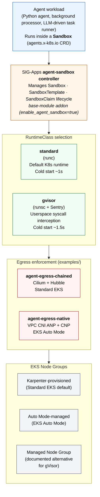

# Agent Sandbox on EKS

The Agent Sandbox on EKS solution deploys a secure, FQDN-filtered Kubernetes environment for running isolated AI agent workloads. It combines kernel-level isolation (gVisor syscall interception), CRD-driven sandbox lifecycle management (the kubernetes-sigs [agent-sandbox](https://github.com/kubernetes-sigs/agent-sandbox) project), and composable egress enforcement (chained Cilium FQDN filtering today, EKS-native `ApplicationNetworkPolicy` on Auto Mode).

## Why?

Agents that execute model-generated code need two guarantees the default Kubernetes pod doesn't provide:

- **Kernel boundary isolation.** Untrusted code running inside the sandbox must not have access to the host kernel's full syscall surface. gVisor's Sentry intercepts syscalls in userspace and serves a restricted subset; Kata+Firecracker (documented as a future tier) adds hardware-virtualization boundaries.
- **Egress policy enforcement.** Agents call LLM APIs, package registries, and developer tools. Without an allowlist, a compromised agent can exfiltrate data or probe internal services. FQDN filtering limits egress to a pre-approved set of destinations.

This solution delivers both. A [reference agent](../../../blueprints/agents/agent-sandbox/README.md) exercises the full chain — provisions inside a gVisor-isolated Sandbox, authenticates to AWS via IRSA, calls Amazon Bedrock for content, executes model-generated code inside the Sentry boundary, and demonstrates both enforcement layers (FQDN block at DNS proxy + L3/L4 block at eBPF).

## Use Cases

- **Secure agent execution:** Run untrusted code — user-uploaded scripts, model-generated shell, prompt-injected tool calls — with kernel-level isolation via gVisor.
- **Multi-tenant agent platforms:** Serve agents from different teams or customers on shared infrastructure with per-tenant network policies and sandbox resource limits.
- **Compliance-driven workloads:** Enforce egress allowlists for regulated environments (financial services, healthcare, government) where agents must only reach pre-approved destinations.
- **Agent evaluation + red-teaming:** Exercise agents in sandboxes that allow you to observe, log, and contain any resulting behavior without risking the host cluster or wider AWS account.

## Architecture



The solution deploys in layers:

- **Amazon EKS cluster** with Karpenter for intelligent node autoscaling. A dedicated gVisor-capable NodePool provisions nodes with the `runsc` containerd shim installed via AL2023 user-data.
- **kubernetes-sigs/agent-sandbox controller** (installed via the SIG-Apps release manifests as a base-module addon) manages `Sandbox`, `SandboxTemplate`, and `SandboxClaim` lifecycle.
- **KRO (Kube Resource Orchestrator)** (ArgoCD-managed base-module addon) composes multi-resource sandbox definitions behind a single `AgentSandbox` custom resource — useful when exposing a simpler surface to developer teams.
- **Runtime tiers:** `standard` (runc, default Kubernetes runtime) and `gvisor` (runsc + Sentry userspace kernel).
- **Egress enforcement** ships as a separate example to keep the sandbox runtime and egress concerns independently composable. Pair the solution with one of:
  - [agent-egress-chained](https://github.com/awslabs/ai-on-eks/tree/main/infra/solutions/agent-sandbox/examples/agent-egress-chained) — Cilium + Hubble chaining for Standard EKS.
  - [agent-egress-native](https://github.com/awslabs/ai-on-eks/tree/main/infra/solutions/agent-sandbox/examples/agent-egress-native) — VPC CNI `ApplicationNetworkPolicy` for EKS Auto Mode.

### Runtime tier threat model

Each tier is a weaker boundary than the one below it — the choice maps to a threat model, not a "is it secure enough?" question.

| Tier | Boundary | Protects against | Does not protect against |
|------|----------|------------------|--------------------------|
| `standard` (runc) | Linux namespaces + seccomp | Other pods in the cluster (via network policies + RBAC) | Host kernel exploitation, syscall abuse, cgroup escapes |
| `gvisor` (runsc + Sentry) | Userspace syscall interception | Host kernel exploitation for most syscalls. Malicious binaries cannot directly invoke host kernel. | Cold-start overhead (~60-90s for first pod per node); Sentry itself is a trusted computing base. |
| Kata + Firecracker (future) | Hardware-enforced microVM (KVM) | All of the above, including hardware-level side channels. Each sandbox gets its own VM with isolated CPU state. | Not shipped in this solution — requires nested virtualization support which EKS Managed Node Groups do not yet provide. |

### Two composition paths

- **Direct Sandbox** — a `ServiceAccount` + `ConfigMap` (agent script) + `Sandbox` applied as three Kubernetes resources. The full spec is visible in one manifest, useful when building your own agent manifests.
- **KRO AgentSandbox** — the same three resources composed from a single `AgentSandbox` custom resource via a kro `ResourceGraphDefinition`. The RGD takes an `iamRoleArn`, `runtimeClass`, `scriptConfigMap` reference, and Bedrock region/model, and materializes the full pod with the same hardened execution context. Useful when exposing a simpler surface to your team.

Both paths produce an equivalent running pod on a gVisor node with IRSA credentials plumbed.

## Prerequisites

- AWS credentials with permissions for VPC, EKS, IAM, and EC2.
- For the reference agent: an IAM role with `bedrock:InvokeModel` on the target Claude model and an IRSA trust policy allowing the cluster's OIDC provider for `system:serviceaccount:agent-sandboxes:sandbox-agent-sa`.
- `terraform >=1.0`, `kubectl >=1.30`, `helm >=3.0`, `aws` CLI v2.

## Deployment

### Step 1: Clone and Navigate

```bash
git clone https://github.com/awslabs/ai-on-eks.git
cd ai-on-eks/infra/solutions/agent-sandbox
```

### Step 2: Configure Variables

Edit `terraform/blueprint.tfvars`:

```hcl
name                = "agent-sandbox"
eks_cluster_version = "1.34"

# region            = "us-west-2"  # set to your preferred region

# ArgoCD-managed sandbox primitives
enable_agent_sandbox = true
enable_kro           = true

# Standard EKS by default. Flip to true for Auto Mode (required for
# the native egress example; note that gVisor tier is not available
# on Auto Mode).
enable_eks_auto_mode = false
```

### Step 3: Deploy the Infrastructure

```bash
./install.sh
```

Deployment takes approximately 20-30 minutes. After completion, configure kubectl:

```bash
aws eks update-kubeconfig --name agent-sandbox --region <your-region>
kubectl get pods -n agent-sandbox-system
kubectl get pods -n kro-system
```

### Step 4: Apply the Workload Manifests

The solution-specific Kubernetes resources (namespace, RuntimeClass, gVisor-capable Karpenter NodePool, SandboxTemplates, reference agent manifests, KRO ResourceGraphDefinition) live under `manifests/` and are applied by the user after the cluster is running:

```bash
cd manifests/

# Resolve the cluster name and Karpenter node role from the live cluster
export CLUSTER_NAME=$(aws eks describe-cluster --name agent-sandbox --query cluster.name --output text)
export KARPENTER_NODE_ROLE=$(kubectl get ec2nodeclass m6i-cpu -o jsonpath='{.spec.role}')

# Apply namespace + RuntimeClass + SandboxTemplates
kubectl apply -f namespace.yaml
kubectl apply -f runtimeclass-gvisor.yaml
kubectl apply -f sandbox-template-standard.yaml
kubectl apply -f sandbox-template-gvisor.yaml

# Apply the Karpenter NodePool (substitute placeholders)
sed -e "s|__CLUSTER_NAME__|$CLUSTER_NAME|g" \
    -e "s|__KARPENTER_NODE_ROLE__|$KARPENTER_NODE_ROLE|g" \
    karpenter-nodepool-gvisor.yaml | kubectl apply -f -

# (Optional) Apply the KRO ResourceGraphDefinition for the AgentSandbox composition path
kubectl apply -f rgd-agent-sandbox.yaml
```

### Step 5: Add Egress Enforcement

Pick one of the two examples based on your cluster's compute mode:

```bash
# Standard EKS
cd examples/agent-egress-chained
./install.sh

# — or — EKS Auto Mode
cd examples/agent-egress-native
./install.sh
```

Each example ships its own README with allowlist-template usage, observability caveats, and portability notes for workloads moving between the two enforcement backends.

### Step 6: Validate the Deployment

Run the reference agent to exercise the full chain:

```bash
cd ../../../../blueprints/agents/agent-sandbox
CLUSTER_NAME=agent-sandbox \
BEDROCK_ROLE_ARN=arn:aws:iam::<account>:role/<role-with-bedrock-invokemodel> \
    ./conformance.sh
```

Conformance exits 0 on success, asserting all five expected PASS/BLOCKED outcomes: PyPI install, Bedrock call, snippet execution, FQDN block, and IP block.

## Configuration Options

| Variable | Description | Default |
|----------|-------------|---------|
| `name` | Cluster naming prefix | `agent-sandbox` |
| `region` | AWS region | Base module default (`us-west-2`) |
| `eks_cluster_version` | EKS version | `1.34` |
| `enable_agent_sandbox` | Deploy the kubernetes-sigs agent-sandbox controller via ArgoCD | `true` |
| `agent_sandbox_version` | kubernetes-sigs/agent-sandbox git ref | `v0.4.3` |
| `enable_kro` | Deploy kro via ArgoCD | `true` |
| `kro_version` | kro Helm chart version | `0.9.1` |
| `enable_eks_auto_mode` | Use EKS Auto Mode instead of Karpenter-managed compute | `false` |

See the base module's `variables.tf` for the full set of toggleable infrastructure options.

## Observability

The solution surfaces two distinct enforcement layers with two different observability paths:

- **FQDN enforcement at the DNS proxy.** Cilium's `toFQDNs` and native `ApplicationNetworkPolicy`'s `domainNames` enforce at the DNS layer. When the pod queries a non-allowlisted FQDN, the DNS proxy returns an empty answer and the pod sees a resolution failure. The pod never attempts a TCP connection, so no L3/L4 flow is generated. Observe via DNS proxy logs (`cilium observe --type l7` or the VPC CNI Network Policy Agent logs), not flow graphs.
- **L3/L4 enforcement at eBPF.** When the pod attempts a raw TCP connection to a non-allowlisted IP (bypassing DNS), the policy drops the SYN packet. The pod sees a connection timeout. Observe via the default Hubble UI Service Map on the chained path, or via the Network Policy Agent on the native path.

The reference agent produces one of each in its five-step sequence — Step 4 exercises the FQDN-layer contract, Step 5 exercises the L3/L4 contract. Both blocks are expected and visible in their respective observability surfaces.

## Cleanup

```bash
cd terraform/_LOCAL
./cleanup.sh
```

This destroys the EKS cluster and all managed resources. IAM roles created outside the solution (e.g., the Bedrock role) are not deleted.

## Next Steps

- Adapt the [reference agent](../../../blueprints/agents/agent-sandbox/README.md) to your own workload — replace `agent.py` with your code, update the FQDN allowlist to cover your outbound domains, and adjust IAM permissions.
- Explore the [allowlist templates](https://github.com/awslabs/ai-on-eks/tree/main/infra/solutions/agent-sandbox/examples) under each egress example — aws-services, llm-apis, dev-tools, package-registries — for ready-made policy bundles you can compose per workload.
- Review the [threat model per tier](#runtime-tier-threat-model) to select the right isolation level for your security posture.
